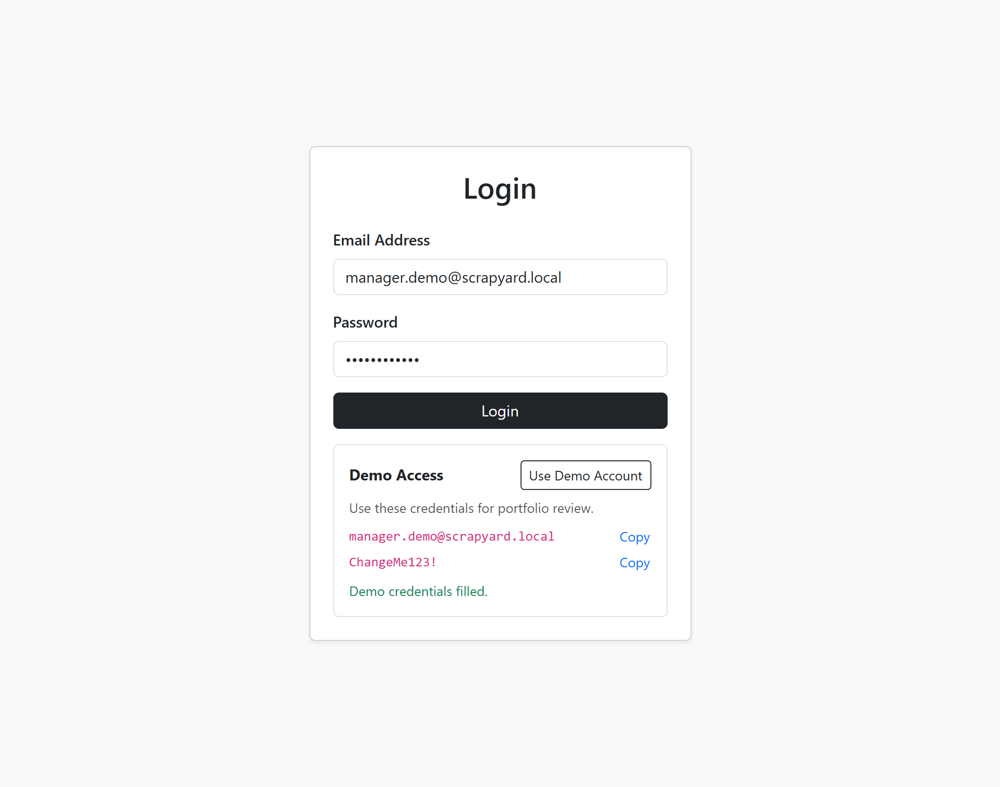
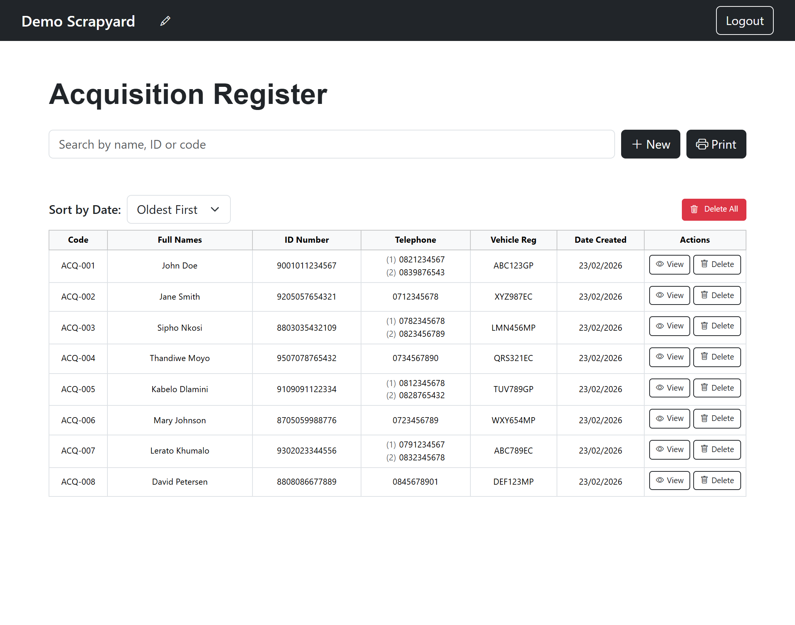
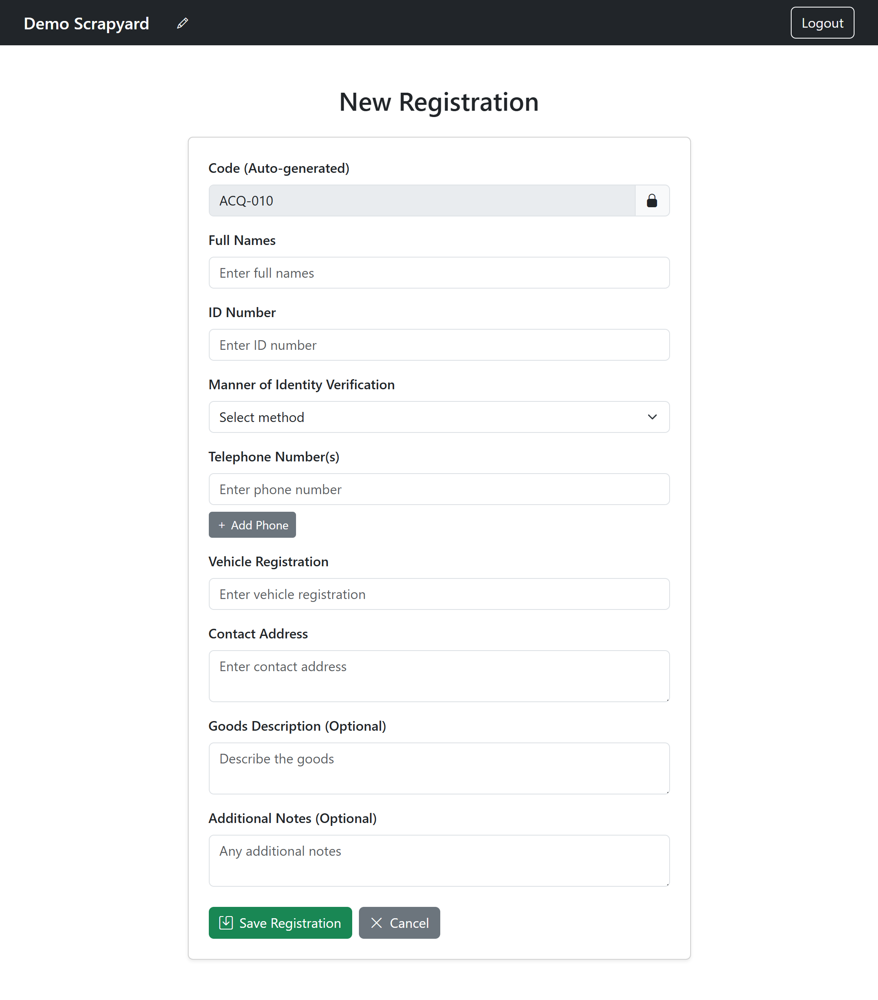
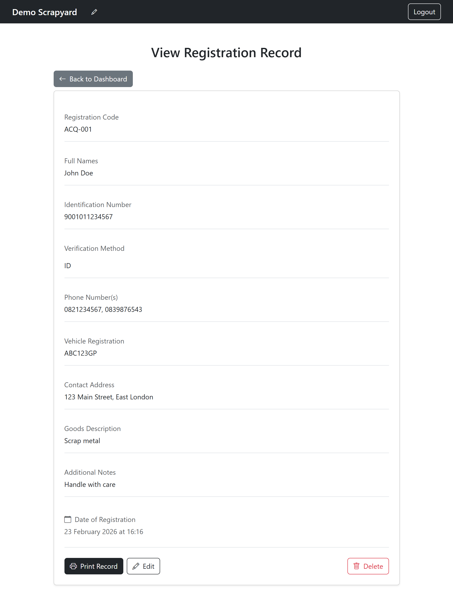

# Scrapyard Registration App

Real, paid application delivered for a local scrapyard operation, with this public version adapted for safe portfolio review.

## Live Application
- Frontend: [https://scrapyard-frontend-portfolio.onrender.com](https://scrapyard-frontend-portfolio.onrender.com)
- Backend API: [https://scrapyard-backend-portfolio.onrender.com/api](https://scrapyard-backend-portfolio.onrender.com/api)

## Source Code
- Frontend Repository: [matthewjmon/scrapyard-frontend-portfolio](https://github.com/matthewjmon/scrapyard-frontend-portfolio)
- Backend Repository: [matthewjmon/scrapyard-backend-portfolio](https://github.com/matthewjmon/scrapyard-backend-portfolio)

This repository is a project overview/case-study hub. The implementation code is intentionally split into dedicated frontend/backend repos to match production deployment boundaries.

## Problem This Solved
- Registration was largely manual, slowing intake during peak periods.
- Duplicate and inconsistent entries reduced trust in operational data.
- Retrieval/printing of transaction records was inefficient for daily workflow and compliance.

## Features Delivered
- Secure login with JWT-based protected routes.
- Full record lifecycle: create, view, edit, delete, bulk delete.
- Sequential acquisition code generation (`ACQ-001`, `ACQ-002`, ...).
- Search and sort tools for fast operational lookup.
- Business name customization per authenticated user.
- Print-optimized register output for filing/compliance.
- Seed tooling for realistic demo data and demo-user provisioning.

## Technical Stack
- Frontend: React, React Router, Axios, Bootstrap, Vite
- Backend: Node.js, Express, MongoDB (Mongoose), JWT
- Hosting: Render (Static Site + Web Service), MongoDB Atlas

## Technical Challenges and Decisions
- Preventing accidental production DB usage in a public demo:
  Added startup validation that only allows demo/portfolio database names.
- Preserving production-style architecture while keeping portfolio clarity:
  Kept frontend and backend as separate deployable repos and documented both from one entry point.
- Balancing recruiter UX with realistic application behavior:
  Added guided demo login helpers while preserving standard auth flows.

## Outcomes
- Reduced registration friction and improved intake speed.
- Lowered duplicate/incomplete entries through structured validation.
- Improved traceability of acquisition records for operations and audit readiness.

## Screenshots
### Login
Clean auth entry with quick demo-access actions.

### Dashboard
Searchable/sortable operations view for day-to-day record management.

### New Record Form
Structured capture flow designed to reduce entry errors.

### Record Details
Detailed per-record view for verification and traceability.

### Print View
Print-friendly layout for physical record workflows.

## Public Demo Note
- This public version is sanitized for portfolio use.
- No production credentials, production data, or private business-sensitive details are included.
